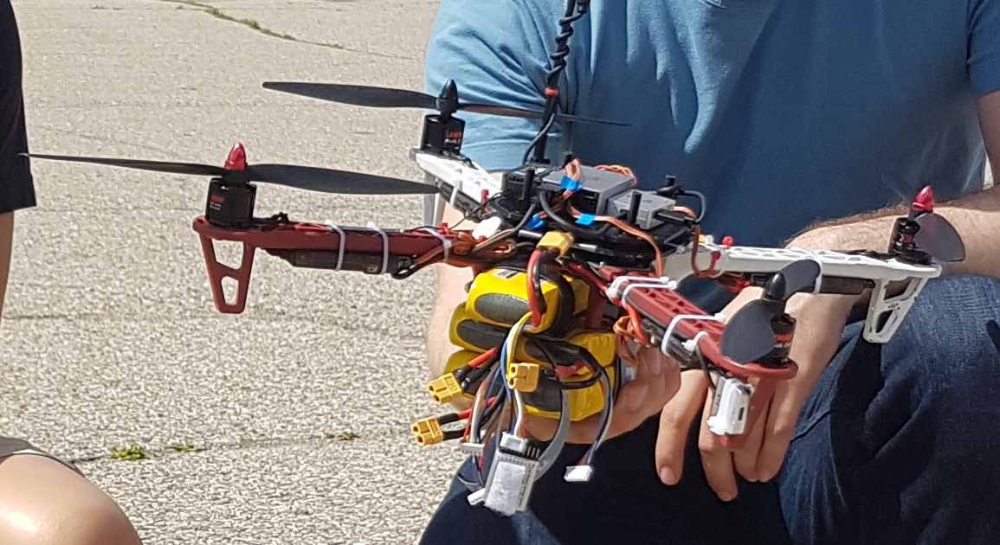
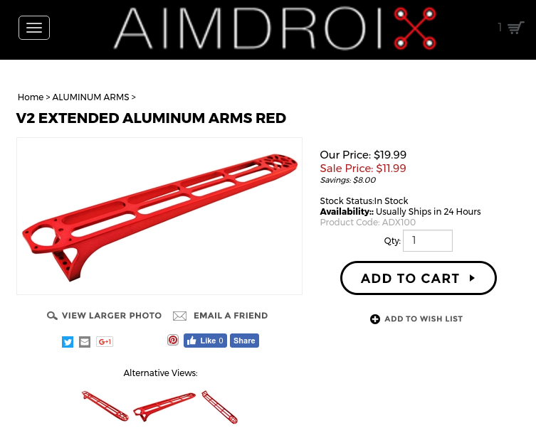
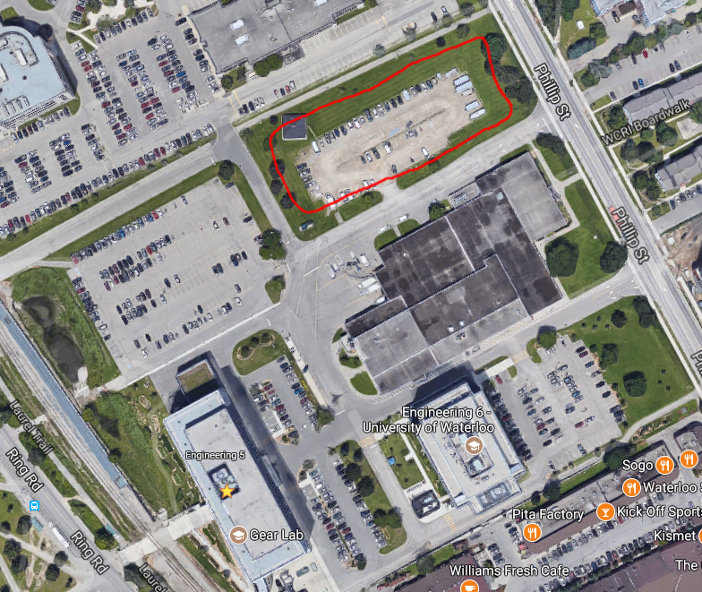

# Updates

## Pixhawk

- Spent 1.5 days to try and get it flying, couldn't even arm the motors.
- Sensors constantly required calibration without a good reason

## DJI N3

- Spent 2 days working
- Had some problems with ESC but was very easy to resolve
- Futaba receiver died
- DJI provide tools to diagnose sensor noise / health

In summary Anastasia can handle a total weight of 2.8kg but it cannot fly
for too long or else the motors will burn out. According to the motors
specifications the EMAX 2133 KV935 used on Anastasia can produce a max
thrust of 850g with a 1045 prop and 4S battery, this means that
theoretically if we want to keep the motors from burning, we should not
exceed the 60% of total max thrust from the four motors.

    # theoretical 60% Max thrust
    (850 * 4) * 0.6 = 2040g

    # base quadrotor weight ~1200g
    2040g - 1200g = 840g

Which means we have **around 850g to add**:

- 2 Cameras
- 1 Gimbal setup
- Odroid or TX1
- PicoPSU

Weights:

    # Camera
    PointGrey Camera:       40g
    ELP Camera:             20g

    # Gimbal System
    SimpleBGC Controller:   40g
    Motors w/o encoders:    36g
    Motors with encoders:   54g
    IMU sensors:            5g

    2-Axis Gimbal system with encoders
      40 + (54 * 2) + (5 * 2) = 158
      
    Stan's Gimbal System: 320g

    2-Axis Gimbal system without encoders
      40 + (36 * 2) + (5 * 2) = 122g

    # Onboard Computer
    Odroid XU4 (bare):      58g
    Odroid XU4 (with case): 84g
    TX1 (without heatsink): 116g
    TX1 (with heatsink):    182g

## Anastasia on STEROIDS?

**If we don't want to worry about weight**, we can use **DJI E800 Motors**, it
has a max thrust of **2.1kg** for each motor, a total of **8.4kg** max thrust
(all four motors).

These [arms](http://store.aimdroix.com/product-p/adx100.htm):

- Converts a DJI F450 frame to a F550 frame
- Allow DJI E800 Motors to be used on a "DJI F450 Frame"
- Arms are made of **Aluminium**
- **Weighs the same** as the stock DJI F450 arms

[ditto:youtube:https://www.youtube.com/watch?v=UHWP2iS3wjE]

Ideally I would like to build 2 quads simultaneously based off a DJI F450 Frame.

1. DJI E800 Motors and our Gimbal Setup
2. Simple Downward facing camera

## Questions that needs answers **urgently**

### Do we need a Global Shutter camera?

Or is a cheap 120FPS rolling shutter camera going to cut it?
E.g. How do I evaluate if rolling shutter is good enough?

### What are we comparing against?

- ASLAM
- MSCKF
- SVO
- DSO

### Where are we going to do it?

Single downward facing camera on the quad and fly in  a square and ROS-bag it?

## Power Wiring

    Battery --> DJI PMU --> DJI N3 Controller
                ESC --> Motors
                PicoPSI --> Odroid XU4 or Nvidia TX1
                Gimbal System
