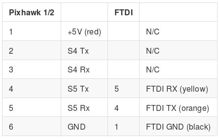

# Pixhawk Serial Communication

Pixhawk has a system console allows low-level access to the system, debug
output and analysis of the system boot process. The most robost method is to
communicate via serial, by using a USB FTDI (connected to the computer) to
Pixhawk's serial port (aka UART port; Serial 4/5 port)

**Note: check which version of the pixhawk you have, you can find out by opening
the enclosure of the pixhawk and find the version number on the PCB. (see image
below)**

## FTDI to Pixhawk Serial 4/5 pinout

## Connect to Pixhawk via Serial

Assuming you are using Linux (which you should), you can communicate via serial
using the `screen` command.

    # install GNU Screen if you don't have it (Ubuntu/Debian)
    sudo apt-get install screen

    # connect to Pixhawk, assuming the FTDI board or cable is connected to
    # /dev/ttyUSB0 with baud rate of 57600 and 8bits No parity
    screen /dev/ttyUSB0 57600 8N1

**VERY IMPORTANT NOTE: You may get a blank screen upon successful execution, press the
"Enter" key three times to activate the USB on the pixhawk, then you
should get the following output**

    nsh >

